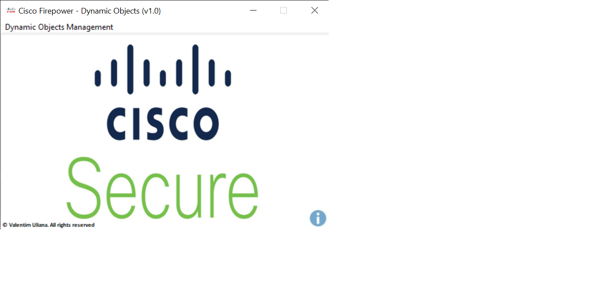

# Cisco Umbrella API Calls

O arquivo .exe está dentro do .rar

Desenvolvido por: Valentim Uliana

Essa aplicação tem como intuito fazer uma quarentena do IP dentro do FMC, e remover automáticamente. Porém é valido a partir da <b>versão 7.0 do FMC & FTD<b>

# Primeiros passos
1. A aplicação é separada em dois scritps: o primeiro é o que faz o controle dos IPs em quarentena, para que ele possa ser removido no tempo correto, e é um script que fica sempre em produção; já o segundo é um executável que você envia as informações direto pro FMC através de uma interface gráfica amigável de de fácil uso.
2. Para o uso nessas aplicações, é altamente recomendado que seja feita a criação de um usuário no FMC para fazer as requisições API.
3. Para a aplicação de remoção e update de quarentena, você irá precisar do Domain UUID, e o ID do Dynamic Object, isso dentro do FMC. Para isso você precisa entrar na página de REST API do FMC que fica é <b> https://IP_DO_FMC_OU_FQDN/api/<u>api-explorer</u></b>. Segue imagens como guia.

Primeiro você encontra seu Domain UUID, como segue na imagem! Eu ja usei como base o endpoint de Dynamic Objects na parte de Objects, mas o Domain UUID você consegue encontrá-lo em qualquer endpoit.
imagem aqui

Com o UUID em mãos, basta anotá-lo para não esquecer. Vamos fazer um HTTP requests de dentro do próprio FMC, para que possamos encontrar o ID do nosso objeto de quarentena. Para isso, dentro do api-explorer, vá em Objects e procure por <b>GET</b> Dynamic objects, clique em "Try it out" e logo em seguida em "Execute"
imagem ReqDynamicObj, execute depois ojectID
4. Pronto, com o Domain UUID, e o ObjectID em mãos, já estamos prontos para começar o uso da nossa aplicação.
5. Pasta raiz da aplicação fica em <b>C:/uses/USERNAME/.cisco_quarantine_ips </b> porque nossa aplicação faz uso de imagens.

# Como utilizar
A aplicação vai trabalhar de modo inteligente fazendo todas as verificações e logando tudo para a pasta de logs da raiz da aplicação! Entre as verificações estão:
1. Se o CSV de Internal Networks foi preenchido corretamente, como citado <b>acima</b> a aplicação vai te informar que está incorreto, não permite o cadastro, e vai gerar um arquivo de log informando a linha do CSV que está incorreta! E também informa qualquer outro CSV que esteja incorreto.
2. No cadastro de Internal Networks, a aplicação é capaz de fazer a verificação se um Ip/Prefixo está correto, se estiver incorreto um arquivo de log é gerado informando quais Ip's que não foram preenchidos corretamente. Lembrando que precisa ser um IP de rede para cadastro no Umbrella.
3. A aplicação vai retornar mensagens em todos os casos, desde de, erros de configuração até quando tudo ocorreu bem e foram feitas as requisições!
4. Toda requisição sucedida, irá gerar um log para o que foi cadastrado no umbrella!
5. Em todos os tipo de cadastros, sendo eles: Site, Internal Networks, Internal Domains ou Destinations a aplicação verifica o que já está cadastrado no umbrella e compara com o CSV, depois ignora tudo o que já está cadastrado e assim só cadastrado o que realmente é novo!
6. Todos os arquivos de logs dão a informação de horário em que a requisição foi feita! São eles : 
   <b>wrongips.log</b> - Arquivo de log dos Ip's que estão errados no CSV de Internal Networks. 
   <b>wrongCSV.log</b> - Arquivo de log que informa as linhas que estão erradas no CSV de Internal Networks(lenbrando que o correto está no <b>item 5</b> do funcionamento), e também informa as linhas erradas em CSV de Internal Domains e Sites. 
   <b>registred_internalNetworks.log</b> - Arquivo de log que informa as Internal Networks do CSV selecionado que foram cadastradas. 
   <b>registred_domains.log</b> - Arquivo de log que informa os Internal Domains do CSV selecionado que foram cadastradas. 
   <b>registred_sites.log</b> - Arquivo de log que informa os Sites do CSV selecionado que foram cadastradas.
   <b>registred_destinations.log</b> - Arquivo de log que informa os Destinos do CSV selecionado que foram cadastradas.
   
  
   

# Investigate
A aplicaçã é capaz de ver a reputação de um Domínio/IP através do Umbrella Investigate, e com isso você conseguirá adicionar esse Domínio/IP em algum Destination list se a disposição for maliciosa.
   
# Reporting
A aplicação é capaz de rodar um reporting do Cisco Umbrella entre duas datas e o resultado do report será um arquivo <b>.csv</b> 
Pontos de atenção:
1. O reporting é feito de hora em hora através de duas datas, com isso consegue trazer mais resultados por tempo indeterminado
2. O limite de cada request é de <b>5000</b>, ou seja, se nessa uma hora de reporting tiver mais que 5000 requisições do Umbrella, ele só vai pegar as 5000 primeiras.
